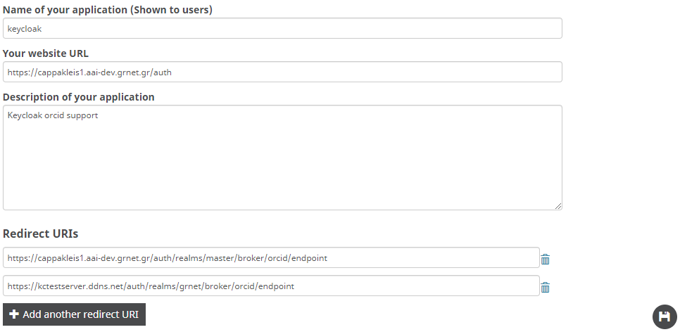

# keycloak-orcid

- [keycloak-orcid](#keycloak-orcid)
  - [Features](#features)
  - [Compatibility](#compatibility)
  - [Installation](#installation)
  - [How to use it](#how-to-use-it)
    - [Requirements](#requirements)
    - [Configuration](#configuration)
      - [Mappers](#mappers)
      - [Theme](#theme)
  - [How to contribute](#how-to-contribute)

This [Keycloak](https://www.keycloak.org) plugin makes possible to add [ORCID](https://orcid.org/) as Social Identity Provider.
[ORCID](https://orcid.org/)  is one of the most popular authentication options for research & education scenarios, including access to the European Open Science Cloud (EOSC).
Although ORCID can be configured as an OpenID Connect Identity Provider, the current ORCID OIDC implementation does not support the release of email and other information (see ORCID OpenID Connect documentation).

## Features

* Social ORCID Identity Provider
* User Attributer Mapper for ORCID Identity Provider
* ORCID theme logo

## Compatibility

Compatible with Keycloak version 15.0.2.

## Installation

The plugin installation is simple and can be done without a Keycloak server restart.

* Download the latest release from the [releases page](https://github.com/eosc-kc/keycloak-orcid/releases)
* Copy the JAR file into the `standalone/deployments` directory in your Keycloak server's root
* Restart Keycloak (optional, hot deployment should work)

Build with command : mvn clean install

## How to use it

### Requirements

In order to configure ORCID as Identity Provider, you need to have account in [ORCID](https://orcid.org/) and make appropriate configuration.

### Configuration

There are a number of steps you have to complete to be able to enable login with ORCID.  Firstly, go to the `Identity Providers` left menu item
and select `ORCID` from the `Add provider` drop down list.  This will bring you to the `Add identity provider` page.

**Add Identity Provider**

You can't click save yet, as you'll need to obtain a `Client ID` and `Client Secret` from ORCID.  One piece of data you'll need from this
page is the `Redirect URI`.  You'll have to provide that to ORCID as `Redirect URIs`.

To enable login with ORCID you must do appropriate configuration through [ORCID Developer Tools](https://orcid.org/developer-tools).

Click the `Register for the free ORCID public API` button.

After agreeing the terms of service, you must complete the form presented to register a new application.

You must configure following values:

* `Name`: The name of your application.
* `Website`: The website the user can visit to learn more about your application.
* `Description`: Information about the application. This will be displayed to users on the OAuth screen.
* `Redirect URIs`: URIs for use with the OAuth 2.0 protocol. Add here the Keycloak `Redirect URI`. This URI will have the following format `https://<keycloak-url>/auth/realms/<realm>/broker/orcid/endpoint`
  Only https Redirect URIs are accepted for original ORCID Registry. You must set up [HTTPS/SSL](https://www.keycloak.org/docs/latest/server_installation/index.html#_setting_up_ssl) in Keycloak.

Click the Save icon at the bottom of the form to generate your API credentials.

Detail information can be found in [ORCID Developer Documentation](https://info.orcid.org/documentation/integration-guide/registering-a-public-api-client/#easy-faq-2606).

You will need also to obtain the Client ID and Client Secret from this page so you can enter them into the `Add identity provider` page.
To obtain this click on `Show Details` button. Go back to `Add identity provider` page and specify those items and finally save your Orcid Identity Provider.

#### Mappers

After creating ORCID as Social Identity Provider, you can add the mappers needed to retrieve the attributes you want.

#### Theme

This plugin provides for login console the theme:
* `orcid-theme`

You could change the login theme to `orcid-theme` from `Themes` tab in realm settings, if you want the ORCID logo to be shown in ORCID Identity Provider button during login process.
Changes provided in this theme can be transferred in any custom login theme.

## Issue management

For any bug or wanted feature, you could open a [jira issue](https://github.com/eosc-kc/keycloak-orcid/issues).
For any information/question you could send us email to eosc-kc-dev@googlegroups.com.
